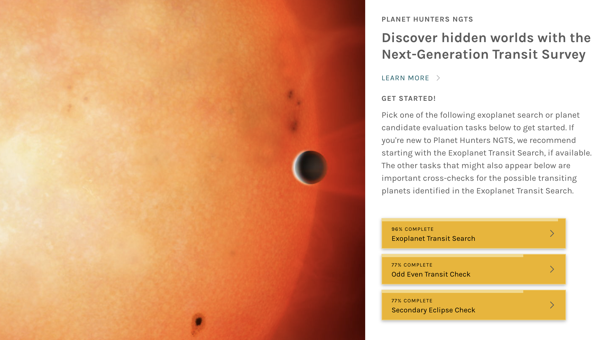
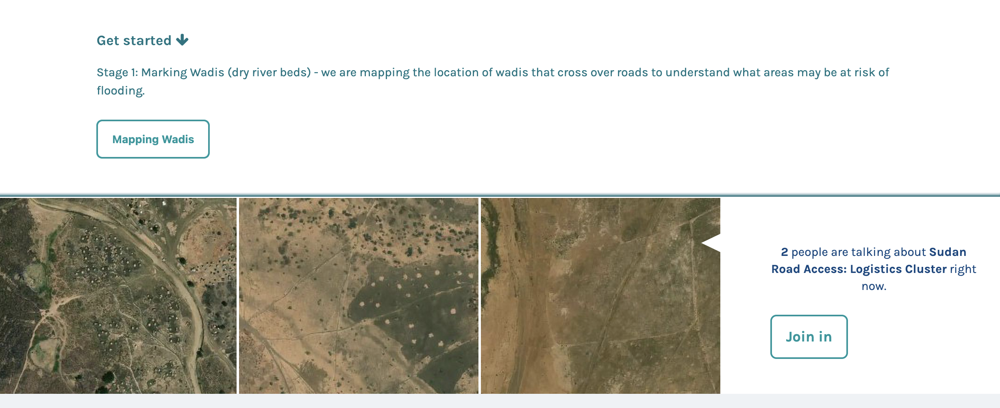
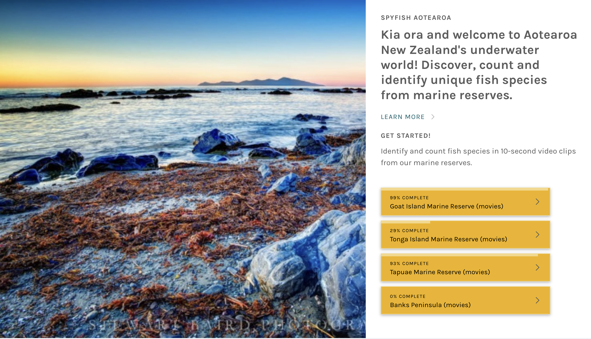
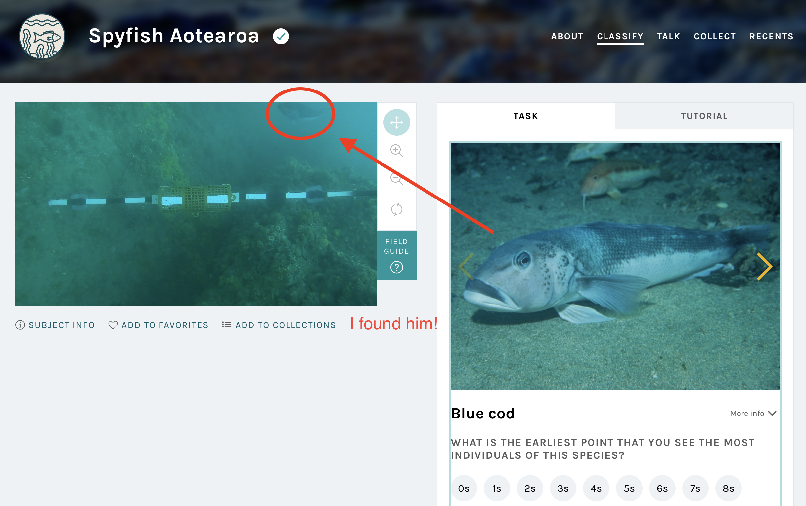
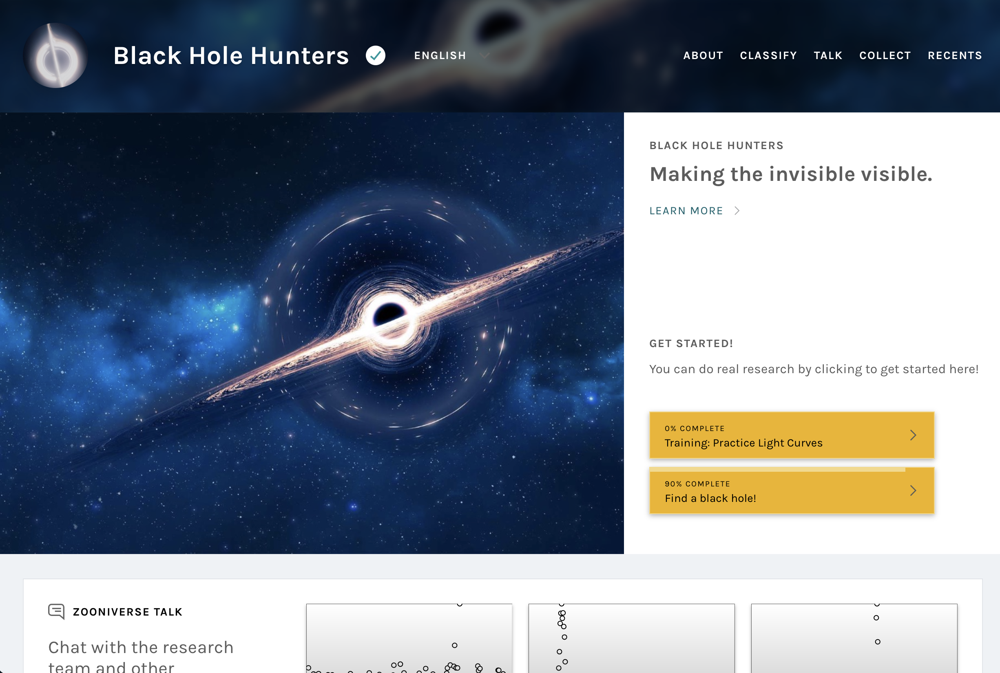
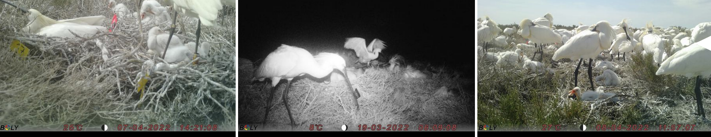
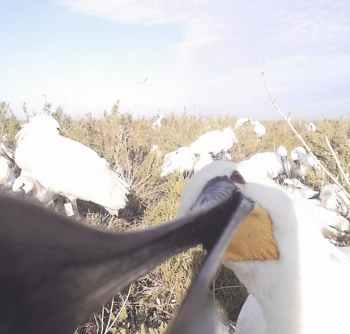

+++
date = '2025-10-04T08:24:44+01:00'
draft = false
title = "My favourite citizen scientist projects"

summary = 'A Zooniverse roundup'
readTime = true
tags = ['science']
showTags = true

+++

I spend ~~a lot~~ a reasonable amount of time on [Zooniverse.org](https://www.zooniverse.org/), a site that allows regular people to contribute to scientific research in a range of fields. Generally, most projects will have you look at an image or video and enter a couple of data points about it, generally identifying things that a computer may have missed in a large dataset. It's a fun way to spend a few minutes that may have otherwise been spent doomscrolling.

I started on a project called [Planet Hunters NGTS](https://www.zooniverse.org/projects/mschwamb/planet-hunters-ngts) which uses data from the Next-Generation Transit Survey to look for exoplanets (planets outside our solar system). I'm _really_ interested in exoplanets (currently-doing-an-integrated-master's-degree-in-astrophysics level of interest) and I wanted to know what transit data looked like. What better way than sorting through a bunch of it looking for exoplanets?! Very exciting.

Obviously I'm keen on the space-themed projects, but there are a lot of other areas of research that I've had fun contributing towards. I've identified fish species in Aotearoa, transcribed 1960's weather data from modern day Burkina Faso (that project is paused for now so it's not listed below), and labeled tags on spoonbills in France.

Below are some projects I found interesting that you may want to take a look at.

## [Planet Hunters NGTS](https://www.zooniverse.org/projects/mschwamb/planet-hunters-ngts) and [Planet Hunters TESS](https://www.zooniverse.org/projects/nora-dot-eisner/planet-hunters-tess)

There are TWO projects on Zooniverse looking for exoplanets! My lucky day!

Both of these projects are looking for transiting exoplanets. We can't literally _see_ exoplanets (with a couple of crazy exceptions), because they're too dim and tiny and they're right next to a literal star, but thankfully there are other ways we can detect them.

Basically, an exoplanet transits if its orbit around its star aligns so it passes in front of the star from our perspective. When this happens, we can see the light from the star get a bit dimmer (because the planet is blocking a small percentage of the light). If we see the same dimming happen on a regular schedule, then we know a planet is transiting the star!

[The first exoplanet](https://en.wikipedia.org/wiki/51_Pegasi_b) was discovered in 1995 and as of writing we've found [7762 exoplanets](https://exoplanet.eu/home/)! Let's find some more!

## [Sudan Road Access](https://www.zooniverse.org/projects/alicemead/sudan-road-access-logistics-cluster)

In this project, you use satellite images to identify wadis (dry river beds) in Sudan. This helps humanitarian aid drivers avoid the rivers when they flood and block roads.

From the project description:

> This project maps key road supply routes for humanitarian aid to reach Sudan. The impending rainy season will likely cut off critical supply routes, as wadis (dry riverbeds) can fill up and flood roads.
> We need to map where wadis cross over roads to help aid organisations plan delivery routes. The data we generate will be crucial for informing humanitarians so aid can reach the people who need it most in the largest displacement crisis in the world, where millions of people are facing starvation.

This project is 93% complete as of writing, but I believe they add more images to classify periodically, so I'm sure there's more to do. I haven't encountered any, but this project does warn that there's a risk of disturbing images, so maybe try a different project if you're not in a good headspace.

## [Spyfish Aotearoa](https://www.zooniverse.org/projects/victorav/spyfish-aotearoa)

This one is a challenge and really gratifying when you start to get it! Watch 10 second underwater clips of fish, then identify how many of what species are there. Theres a field guide to help you identify fish species and it gets easier as you go along.

## [Black Hole Hunters](https://www.zooniverse.org/projects/cobalt-lensing/black-hole-hunters)

Black holes are fucking sick.

# [Beluga Bits](https://www.zooniverse.org/projects/stephenresearch/beluga-bits)

> During the summer thousands of beluga whales visit the estuary and at that time [www.Explore.org](http://www.Explore.org) runs a live-streaming underwater video from a zodiac that people around the world can view. During the beluga season (from mid-July until the end of August) we ask viewers to capture snapshots when they see beluga or other interesting species in the estuary.

I really like belugas. Probably because of [the Raffi song](https://www.youtube.com/watch?v=mIBY-LQYkVA).

# [Where is Spoony?](https://www.zooniverse.org/projects/hugo-ferreira/where-is-spoony)

Researchers in Camargue, Southern France plant cameras in the Eurasian Spoonbill's breeding area and tag the birds with individual codes. You get to review stills and try to identify the codes. It's a bit like Where's Waldo/Wally spotting the little tags on the birds' legs. I find it rewarding.

Plus, the birds are hilarious.

## 

---

In all of these projects, you will need to do a bit of guesswork. It can be tempting to say "I'm not sure if this is right, I'll just skip this one", but it's worth noting that every photo/video/piece of data is classified by multiple volunteers, so if you're wrong someone will catch it. It's much more helpful to give your best guess.

It's really quick to get started with any of these projects, so give it a go and contribute to science!
