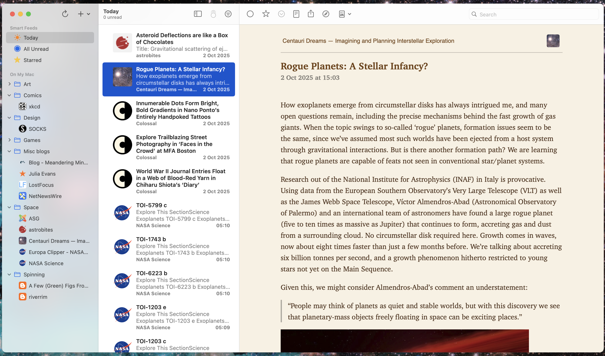

+++
date = '2025-10-03T08:24:44+01:00'
draft = false
title = "Why I'm starting a personal blog in 2025"

summary = 'Social media, the small web, and RSS feeds'
readTime = true
tags = ['internet']
showTags = true

+++

If you're reading this, my first post on my new blog, anytime near my writing it, you probably know me in real life and are here because I sent you the link. So you probably know that I've not been very active (or at all active) on social media since the good old days of an ad-free, chronologically-organised Instagram.

I deleted facebook in 2014. (Though briefly reinstated it in 2015 when I lost my phone in the Faroe Islands and it was my only way of contacting anyone back home.) (Maybe more about that another time.) I've had Instagram since 2011 or so but have never really kept up with it. Lately, I open the app, get barraged by ads and posts from people I don't follow, and close it within 30 seconds. I also just don't take enough highly-polished pictures of myself/my home/life to post. Everyone else seems to be doing these monthly round-ups of highly-polished aesthetic photos and I just have 20 pictures of my cat with junk in the background.

And sure, I could post those pictures of my adorable cat and say fuck being polished. Maybe my doing that would be the tiniest nudge toward making Instagram a more enjoyable and realistic place. But, there's still the ads, and the data mining, and the fact that Meta owns all the images on Instagram... and here I go closing the app again.

So instead, my social media use has become lurking on TikTok and tumblr, never posting any of my own stuff. But this is a very different experience than the friendly back-and-forth sharing I used to have with friends and family back in the day. It's more like watching tv, except with more ads and each show is 2 minutes long and full of misinformation (and I skip most of them after 3 seconds).

So how do I keep in touch with my friends and family, nearly all of whom live far away, often with a time difference? I've decided to go with a combination of trying to keep on top of my messages better and trying to herd everyone I know onto the small web.

If you're not familiar with the term 'small web', it's basically a return to the early days of the internet when people had personal websites and everything wasn't owned by 4 enormous companies. There's a good (somewhat technical) explainer about it [here](https://benhoyt.com/writings/the-small-web-is-beautiful/).

So, instead of trying to force myself to use Instagram _again_, I set up an RSS reader.

## What is an RSS reader and why should I have one?

An RSS reader is a bit like an email inbox, but for websites you subscribe to. Or, you can think of it as a podcast feed but for reading. Basically, it works by maintaining a list of website feeds you want updates from, checking to see if there have been updates, and organising them for you.

A screenshot of my RSS reader, NetNewsWire.

You can add a link to pretty much any website that has a feed, but it's best for blogs and news feeds that don't update very often. You don't have to check if there's a new post on the website because it shows up automatically in your RSS reader.

This is an ideal way to keep up with blogs like the one you're reading now. I have categories for different topics, including:

**Space**

- My local astronomical society's news feed
- Some independent astronomy blogs
- Updates from NASA's [Europa Clipper](https://science.nasa.gov/mission/europa-clipper/) mission (which is what got me into astronomy and astrophysics)

**Comics**

- Just the wonderful [xkcd](https://xkcd.com/) so far

**Games**

- Now I won't miss updates on Concerned Ape (the creator of Stardew Valley)'s new game [Haunted Chocolatier](https://www.hauntedchocolatier.net/)

You may now be thinking, "Okay, but I don't read any blogs. I'm not sure how to find any that would be interesting to me."

And that's understandable! We're not used to looking for interesting things on the internet anymore. Now, you just open an app and watch/read whatever is served up to you.

The good news is, the only way for people to find these blogs are for people to make collections of them. A lot of blogs also have a list of other blogs they recommend. [Blogroll](https://blogroll.org/) is a great place to get started, but you can also just google (or DuckDuckGo, if we're avoiding the big tech companies) '[interest] blog'. That's how I found some of my favourite astronomy blogs.

You can set up an RSS reader for your browser or download a native app like I did. There are paid platforms but also some good free ones. [NetNewsWire](https://netnewswire.com/) is a great free and open-source RSS reader for Apple devices.

---

While I can't imagine all my friends and family setting up blogs immediately (or ever), it would be incredible to have a folder full of personal blogs of people I know in real life sending me all their random thoughts and weird interests. Why should all my communication with my friends in other cities and my family across an ocean be owned by Meta? I'm no longer letting "the algorithm" decide what I see/read/know about.

One last thing about the small internet:
Since I set up my RSS reader and started intentionally looking for small websites and personal blogs, I've not seen one with a pop up asking me to enable cookies. I've not even gotten a pop up asking me to sign up to their newsletter. They don't want my email address, because they use RSS feeds! I'm starting to like the internet again.
