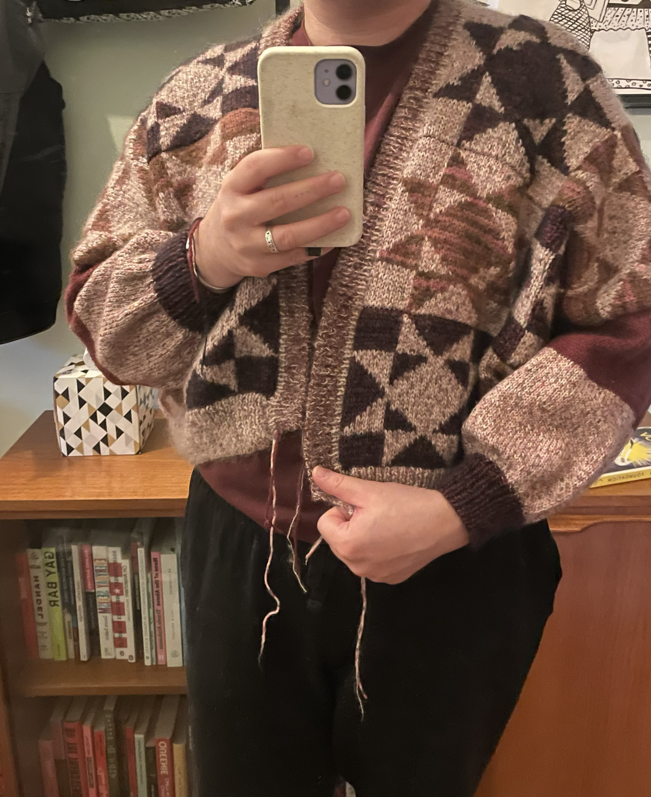
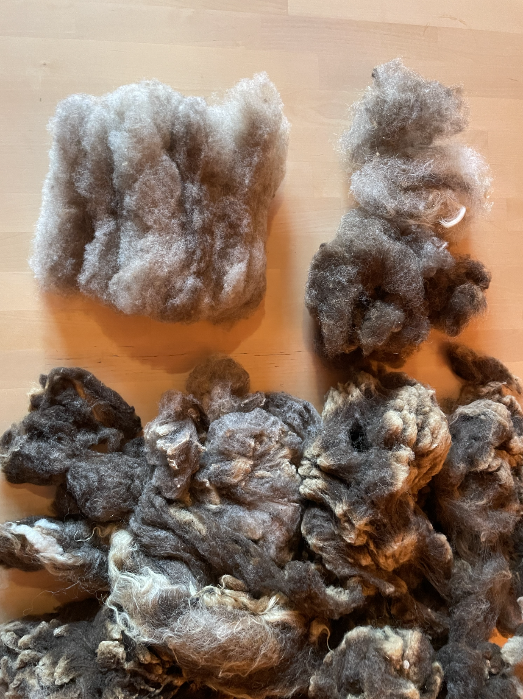

+++
date = '2025-10-08T14:42:32+01:00'
draft = false
title = "My new fibre hobby"

summary = "Why buy yarn when you can buy a whole sheep's fleece?"
readTime = true
tags = ['fibre arts', 'spinning']
showTags = true
+++

I started spinning (as in, hand-spinning yarn, with a spinning wheel) this summer. I've always been interested in textile in fibre arts and this seemed like an extreme but perhaps inevitable step. When I first saw spinners on social media I was surprised people still did that. I've since learned it's not as fringe as I initially assumed and there's a large community of spinners out there.

I'd already done sewing, knitting, crocheting, embroidery, cross stitch, and tatting. You could even go back to primary school and count bracelet making. I'd done most crafts you can do with a needle and thread and yarn. I could give [bobbin lace](https://en.wikipedia.org/wiki/Bobbin_lace) a try, but I'm not much of a lace person and don't have a lot of interest in the final product.

What I am interested in is yarn. I use a lot of yarn, and as I've used more of it I've gotten a taste for the expensive stuff. Why spend £2 on a skein of acrylic yarn that will shed microplastics and make my hands sweat while I'm knitting when I could spend... more... but get lovely wool that's soft and insulating and will last the rest of my life but is also biodegradable?

The thing is, sometimes I want a very specific colour and texture and my only options are very expensive. The yarn for my latest knitting project, a quilt-inspired cardigan, cost around £155. That's more than I would pay for a cardigan from a shop, but this one is made in the colours I want, to my measurements, and if taken care of correctly could outlive me. And I had fun making it.

(The pattern is [Heirloom Quilt Cardigan](https://www.ravelry.com/patterns/library/heirloom-quilt-cardigan) by [Katryn Seeburger](https://www.ravelry.com/designers/katryn-seeburger), if you're interested.)

_Ignore the ends, I haven't woven them in or blocked it yet._

So how do I do more of that without spending all my money on hand-dyed [baby suri](https://www.springfarmalpacas.co.uk/alpaca-walking-2/unnamed-4/) [silk](https://loopknitting.com/collections/lace-weight-yarns/products/la-bien-aimee-kumo)?

The answer appears to be buying a whole sheep fleece and spinning it myself.

This is a bit daunting, to say the least. Spinners generally buy fleeces "raw", which means it's still as dirty as it was on the sheep (though it's hopefully been skirted (had any poo/stained bits removed)). The fleece will need washing to remove the dirt and pieces of hay and lanolin (the natural oil produced by the sheep which is solid at room temperature).

(At this point I feel it necessary to point out the difference between a fleece and a pelt. Spinners are not using sheep pelts with the skin on them. When I'm talking about sheep fleeces, I mean the wool that is removed from the sheep when it gets a haircut once or twice a year. This does not involve killing the sheep or even hurting it. On the contrary, sheep need to be shorn to stay healthy. Okay, back to the fibre talk.)

I was able to find [a company](https://www.benridgewoolworks.co.uk/) that sells british fleeces and has a wash and dry service. Since I don't have the energy to hand wash and rinse (at least twice) 1-3kg of wool and I definitely don't have the space to dry it. (Glasgow has an [average humidity of 79%](https://weather-and-climate.com/average-monthly-Humidity-perc,glasgow-gb,United-Kingdom) over the year. It's hard to dry laundry even with our dehumidifier on every day all year round.)

So, I ordered my first fleece! I decided on a beige [Shetland](https://en.wikipedia.org/wiki/Shetland_sheep)(the website said beige but I think it looks like [musket or moorit](https://en.wikipedia.org/wiki/Shetland_sheep#Colours_and_patterns) - either way, it's not beige), which was maybe a bold choice for my first. Shetland sheep are a 'primitive' breed, which basically means old/ not cross-bred in recent history. They have a double coat, with an outer hairy layer and a soft, downy undercoat. Both are usable, but I've decided to pull them apart and process them separately.

_A close-up of the fleece as it arrived, showing the crimpy, soft, undercoat on the left and some locks of the long, hairy outercoat on the right._

Here's where I'm at so far:

- 30g undercoat, carded and ready to spin
- 29g (undercoat) and 40g (outercoat), separated, not yet carded
- 736g unseparated but mostly clean

_Bottom: around 1/3 of the total fleece, unseparated and as it arrived
Top right: separated wool, with the outercoat above and the undercoat below
Top left: carded undercoat ready to spin_

It's a really beautiful fleece with a lot of colour variation and the undercoat is so so soft.

I have plans for both the undercoat and the outercoat - more on that next time!

> Edit: In an earlier version of this post, I forgot to talk about the price of fleeces. Obviously they're a lot cheaper than their weight in yarn. While the different yarns for my cardigan cost between £10 and £30 per 100g, the whole fleece plus the wash and dry service cost £25.
